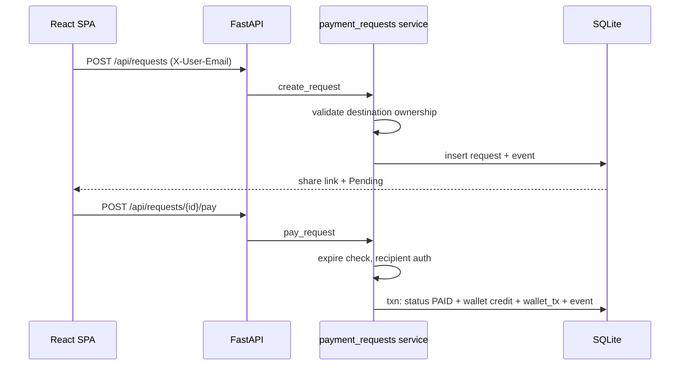

# Implementation Plan: P2P Payment Requests

**Branch**: `001-p2p-payment-request` | **Date**: 2026-05-17 | **Spec**: [spec.md](./spec.md)

**Input**: Feature specification from `specs/001-p2p-payment-request/spec.md` plus stakeholder implementation architecture (React/Vite/TS, FastAPI, SQLAlchemy, SQLite, Playwright, single-service deploy).

## Summary

Build a responsive consumer fintech web app where authenticated users create payment requests to friends, manage incoming/outgoing requests on a dashboard, fulfill requests via simulated wallet credit, and complete decline/cancel/expire lifecycles. Every request must pay into a **destination owned by the sender** (prototype: internal TRY wallets only). FastAPI owns all business rules, authorization, expiration, and audit events; React provides the UI; SQLite persists prototype data with a path to PostgreSQL in production.

## Technical Context

**Language/Version**: Python 3.11+ (backend), TypeScript 5.x (frontend)

**Primary Dependencies**: FastAPI, SQLAlchemy 2.x, Pydantic v2, Uvicorn; React 18, Vite 5, React Router; Playwright (E2E); pytest + httpx (backend tests)

**Storage**: SQLite (`backend/data/app.db` or env-configured path). **Production note (README)**: PostgreSQL or another managed RDBMS required for production.

**Testing**: pytest (backend unit/integration), Playwright with `video: 'on'` in config (E2E), deterministic `backend/seed.py`

**Target Platform**: Linux/macOS dev; single container or PaaS (Render/Railway) for deploy

**Project Type**: Web application (SPA + REST API), monorepo with `backend/` and `frontend/`

**Performance Goals**: Prototype-scale (<100 concurrent users); API p95 < 500ms on local SQLite; pay flow UI loading 2–3s (product requirement)

**Constraints**: No float money; Decimal parse → integer minor units; mock email auth only; no raw card/bank/IBAN collection; server-side authorization on all mutations; expiration evaluated on read/action (not background worker in prototype)

**Scale/Scope**: 3 seed users, 5 pages, 11 API route groups, 6 tables, 10 E2E scenarios, ~15 backend tests for critical invariants

## Constitution Check

*GATE: Must pass before Phase 0 research. Re-check after Phase 1 design.*

| Gate | Status | Notes |
|------|--------|-------|
| Project constitution ratified | N/A | `.specify/memory/constitution.md` is template-only; gates derived from feature spec FR/SC |
| Security: no sensitive financial data collection | PASS | Internal wallet destinations only; schema reserves encrypted/hash/masked fields |
| Server-side authorization | PASS | All mutations via FastAPI services with actor checks |
| Test coverage for money invariants | PASS | E2E + pytest for destination ownership, duplicate pay, terminal transitions |
| Simplicity / YAGNI | PASS | Single deploy unit; on-read expiration; mock auth |

**Post-design re-check**: PASS — data model, contracts, and service boundaries enforce FR-004–FR-027 without extra microservices.

## Project Structure

### Documentation (this feature)

```text
specs/001-p2p-payment-request/
├── plan.md              # This file
├── research.md          # Phase 0 decisions
├── data-model.md        # Phase 1 schema & transitions
├── quickstart.md        # Phase 1 dev/run guide
├── contracts/           # OpenAPI + share DTO contracts
│   └── openapi.yaml
├── spec.md
├── checklists/
└── tasks.md             # Phase 2 (/speckit-tasks — not created here)
```

### Source Code (repository root)

```text
backend/
├── app/
│   ├── main.py                 # FastAPI app, static mount, routers
│   ├── config.py               # Settings (DB path, CORS, static dir)
│   ├── database.py             # Engine, session, Base
│   ├── models.py               # SQLAlchemy models
│   ├── schemas.py              # Pydantic request/response models
│   ├── auth.py                 # get_current_user, X-User-Email / session
│   ├── routers/
│   │   ├── auth.py
│   │   ├── wallets.py
│   │   └── payment_requests.py
│   └── services/
│       ├── money.py            # Decimal → minor units, currency validation
│       ├── security.py         # Hashing (email, phone, contact), snapshots
│       ├── wallets.py
│       ├── payment_destinations.py
│       ├── payment_requests.py # CRUD, list filters, state machine
│       ├── expiration.py       # expire_pending_requests*
│       └── events.py           # request_events writer
├── seed.py
├── tests/
│   ├── conftest.py
│   ├── test_payment_requests.py
│   └── test_money.py
├── requirements.txt
└── pyproject.toml              # optional

frontend/
├── src/
│   ├── main.tsx
│   ├── App.tsx                 # Routes
│   ├── api/client.ts           # fetch + X-User-Email
│   ├── auth/AuthContext.tsx
│   ├── pages/
│   │   ├── LoginPage.tsx
│   │   ├── DashboardPage.tsx
│   │   ├── CreateRequestPage.tsx
│   │   ├── RequestDetailPage.tsx
│   │   └── ShareRequestPage.tsx
│   ├── components/             # Layout, forms, table/cards, etc.
│   └── styles/global.css
├── index.html
├── vite.config.ts
├── package.json
└── tsconfig.json

e2e/
├── playwright.config.ts        # video: 'on'
├── tests/
│   └── payment-requests.spec.ts
└── package.json

README.md                       # Product, stack, Spec-Kit, security, deploy
```

**Structure Decision**: Web application layout per stakeholder input. FastAPI serves `frontend/dist` in production; Vite dev server proxies `/api` to Uvicorn during development.

## Architecture

### Request flow



### Layer responsibilities

| Layer | Responsibility |
|-------|----------------|
| **Routers** | HTTP mapping, dependency injection, status codes |
| **Services** | Business rules, transactions, authorization |
| **Models** | Persistence, indexes, constraints |
| **Schemas** | Input validation, safe response DTOs (no leaks on share) |
| **Frontend** | UX, form validation, loading states; no business rules |

### Authentication (prototype)

- `POST /api/auth/login` with `{ "email": "..." }` upserts user, ensures default wallet + destination, returns user profile.
- Protected routes: `Depends(get_current_user)` reads `X-User-Email` header (frontend stores email in `localStorage` / context after login).
- README documents: **not production-safe**; replace with OAuth/JWT before launch.

### Expiration

- `expiration.expire_for_user(db, user_id)` runs before list/detail and inside pay/decline/cancel.
- Bulk-expire query: `status=PENDING AND expires_at <= now()` → `EXPIRED`, set `expired_at`, emit `REQUEST_EXPIRED`.
- README: production should use scheduled worker + same service function.

### Payment (simulated)

- Single DB transaction: row lock or `UPDATE ... WHERE status='PENDING'` optimistic check → PAID, credit `wallets.balance_minor` for destination's `wallet_id`, insert `wallet_transactions` CREDIT, `REQUEST_PAID` event.
- Idempotency: second pay returns 409/422 with clear message; no second credit.

### Static assets & SPA routing

- `main.py`: mount `StaticFiles` on `/assets`; catch-all `GET /{path}` returns `index.html` except `/api/*`.
- Vite `base: '/'`; React Router paths: `/login`, `/dashboard`, `/requests/new`, `/requests/:id`, `/r/:shareToken`.

## API Surface (summary)

See [contracts/openapi.yaml](./contracts/openapi.yaml) for full contract.

| Method | Path | Auth | Purpose |
|--------|------|------|---------|
| POST | `/api/auth/login` | No | Mock login / register |
| GET | `/api/auth/me` | Yes | Current user |
| GET | `/api/wallets/me` | Yes | Default wallet balance |
| GET | `/api/payment-destinations/me` | Yes | User destinations for selector |
| POST | `/api/requests` | Yes | Create request |
| GET | `/api/requests` | Yes | List (`direction`, `status`, `search`) |
| GET | `/api/requests/{id}` | Yes | Detail + events |
| GET | `/api/share/{share_token}` | No | Public safe summary |
| POST | `/api/requests/{id}/pay` | Yes | Recipient pay |
| POST | `/api/requests/{id}/decline` | Yes | Recipient decline |
| POST | `/api/requests/{id}/cancel` | Yes | Sender cancel |

## Frontend Routes

| Path | Component | Notes |
|------|-----------|-------|
| `/login` | LoginPage | Email form |
| `/dashboard` | DashboardPage | WalletSummary, filters, RequestTable/Card |
| `/requests/new` | CreateRequestPage | CreateRequestForm + DestinationSelector |
| `/requests/:id` | RequestDetailPage | Actions by role/status |
| `/r/:shareToken` | ShareRequestPage | Public limited view |

## Testing Plan

### E2E (Playwright)

1. Login → default wallet + destination exist  
2. Create request with own destination  
3. Sender outgoing Pending  
4. Recipient pay + 2–3s loading  
5. Both see Paid  
6. Sender wallet balance increased  
7. Recipient decline → Declined  
8. Sender cancel → Cancelled  
9. Expired request pay rejected  
10. Dashboard filter + search  

Config: `use: { video: 'on' }`, output `e2e/test-results/` (document in README).

### Backend (pytest)

- Cannot create request with another user's `destination_id` → 403  
- Duplicate `POST .../pay` → single wallet credit  
- Pay/decline/cancel on PAID/DECLINED/EXPIRED/CANCELLED → 4xx  

## Deployment

- **Build**: `cd frontend && npm run build` → `frontend/dist`  
- **Run**: `uvicorn app.main:app` with `STATIC_DIR` pointing to `frontend/dist`  
- **PaaS**: Render/Railway — one web service, `DATABASE_URL` still SQLite file or volume for prototype; README states PostgreSQL for production  
- **Seed**: `python -m seed` or `python backend/seed.py` on deploy/start optional  

## Seed Data

Users: `ogulcan@example.com`, `ayca@example.com`, `mehmet@example.com` — each with TRY internal wallet, active internal-wallet destination, and sample requests across PENDING, PAID, DECLINED, EXPIRED, CANCELLED (including one expired >7 days for E2E).

## Complexity Tracking

No constitution violations requiring justification. Service layer split is minimal (7 modules) and aligned with stakeholder file list.

## Generated Artifacts

| Artifact | Path |
|----------|------|
| Research | [research.md](./research.md) |
| Data model | [data-model.md](./data-model.md) |
| API contract | [contracts/openapi.yaml](./contracts/openapi.yaml) |
| Quickstart | [quickstart.md](./quickstart.md) |

**Next command**: `/speckit-tasks` to generate dependency-ordered `tasks.md`.
